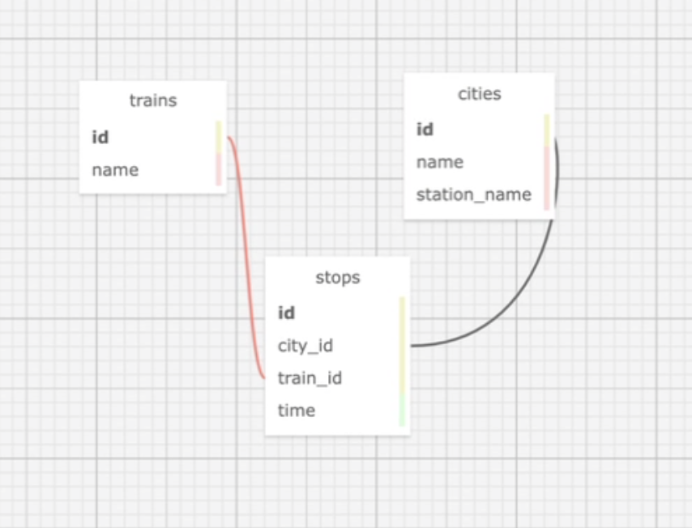

# Train System

#### By Frank Proulx, Christopher Neal, Morgan Waites
 
#### This is an app for a site that allows the user to add albums, artists, and songs for imaginary train site.

## Technologies Used

* Ruby
* Gems
* Bundler
* Rspec
* Pry
* Sinatra
* Capybara
* Postgres
* SQL
* SQL Designer
* Rake

## Description

  Webpage display list of albums for hypothetical Record Store. User can add, edit, delete albums as well as artists and songs. Shows CRUD functionality and knowledge in relational databases. Database has tables for artists, albums, and songs and, lastly, a join table to show many to many relationship between albums and artists.

## Setup/Installation Requirements

* Create and/or navigate to the directory you would like to contain this project on your computer.
* Initialize a git repository by typing **git init** in the terminal.
* Type **git clone https://github.com/ChristopherMNeal/train_system** to clone the repository to your local machine.
* Navigate into project directory by typing cd the_word_definer  
* Type bundle install in the terminal to populate gems
* To create a database using the rake with the database backup included in this project, type in your terminal: 
      `rake build\["train_system"\]`

* Or, without rake, type in your terminal:  
      `createdb [DATABASE NAME]`  
      `psql [DATABASE_NAME] < database_backup.sql`  
      `createdb -T [DATABASE_NAME] [TEST_DATABASE_NAME]`

* After building the database, type rspec in the terminal to confirm passing of all tests  
* Type ruby app.rb to run the program with Sinatra
* Open browswer and enter the url "http://localhost:4567/" unless otherwise prompted in the terminal

## Known Bugs

* When album that user tries to add to artist does not exist, error page is not handled.
* Not all rspec tests pass; we left two useful fails in artists spec file.

## License

[MIT](https://opensource.org/licenses/MIT)

If you have any issues, questions, ideas or concerns, please reach out to me at my email and/or make a contribution to the code via GitHub.  

Copyright (c) 2021 Frank Proulx, Christopher Neal, Morgan Waites

## Notes

* To do a database dump using rake, type in your terminal from the project root folder: `rake dump\["train_system"\]`.
* To do a database dump without rake, `pg_dump [name of database] > database_backup.sql` in root directory
* To create database first enter psql then `CREATE DATABASE [name];`
* `\c [name of database]`
* Make schema, `CREATE TABLE [name of table] (column_name datatype, ...);`
* Make all tables you need, don't forget join table!!
* To check schema `\d [database name]`
* `CREATE DATABASE [name of test database] WITH TEMPLATE [name of main database you just created];`
* if you get an error in psql, check for semicolon!! 